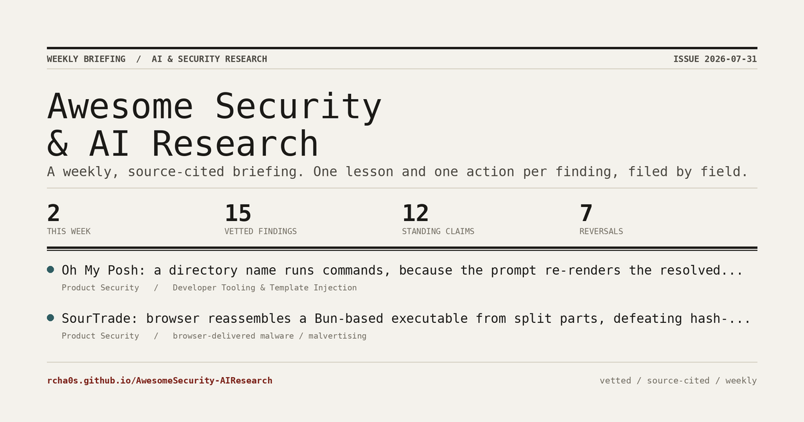

# Awesome Security & AI Research

<p align="center"><a href="https://rcha0s.github.io/AwesomeSecurity-AIResearch/"></a></p>

> **A weekly, source-cited briefing on AI security, product security, and applied AI research.** Every week it scans a ranked set of sources (X, GitHub, YouTube, blogs, newsletters, RSS), keeps only the findings that teach something you can act on, and files each one under **AI Security**, **Product Security**, or **AI Research** with a one-line lesson and a concrete next step.

    

<h3 align="center"><a href="https://rcha0s.github.io/AwesomeSecurity-AIResearch/">Read this week's briefing &#8594;</a></h3>

The live site opens on this week's briefing (the lead finding, what's trending, what's most novel, and the strongest research in each field), then lets you browse every subfield, filter the claim ledger, and search the full feed. The markdown below is the same data, readable on GitHub.

### What makes it different

- **Findings age out; claims don't.** A finding is one article, good for about a month. A **claim** is a durable answer to a recurring question ("which serialization should agents use?"). The [claim ledger](claims/README.md) keeps the current answer on top and every answer it replaced underneath, with the date and reason it was retired, so you can see what the field stopped believing and why.
- **One lesson, one action.** Nothing here is a link dump. Each finding is distilled to the transferable lesson and the concrete thing to do about it.
- **Vetted, not scraped.** A finding is shown only after it clears a novelty and relevance bar, its lesson excerpt is grounded against the source text, and a separate model pass cross-checks the claim. This is automated review, not human review; everything that fails waits in the [review queue](REVIEW.md), and nothing is deleted.
- **Every claim cites its sources.** No anonymous assertions; follow the evidence yourself.

## This week's snapshot

> The top curated findings published in the last 7 days. Each entry is the gist (what's new, why it matters, what to do), and links to both its writeup here **and** the original source. For the full digest see the [newsletter](NEWSLETTER.md).

- **[Oh My Posh: a directory name runs commands, because the prompt re-renders the resolved path through a template engine whose funcmap has cmd](product-security/developer-tooling-template-injection/2026-07-oh-my-posh-a-directory-name-runs-commands-because-the-prompt.md)** · Product Security · Jul 24, 2026 · composite **57.0** · [source ↗](https://github.com/advisories/GHSA-6xj8-qv9j-xcjq)  
  Anything that renders your prompt, status bar or editor title is executing attacker-controlled repository metadata - treat it as a parser, not decoration.
- **[SourTrade: browser reassembles a Bun-based executable from split parts, defeating hash-based detection with per-session builds](product-security/browser-delivered-malware-malvertising/2026-07-sourtrade-browser-reassembles-a-bun-based-executable-from-sp.md)** · Product Security · Jul 25, 2026 · composite **55.2** · [source ↗](https://thehackernews.com/2026/07/malvertising-sends-malware-in-pieces.html)  
  Client-side payload assembly (split parts + per-session hashing) breaks hash-based detection, so hunt the whole delivery chain and behavioral signals, not the final-file signature.

## Standing claims

> The databases below track **what was published**. The ledger tracks **what we currently believe**: 12 standing answers, each with the evidence behind it, plus 7 retired ones kept underneath with the date and reason they stopped being true. See the [full ledger](claims/README.md).

- **[AI Security](claims/ai-security.md)** - 5 standing · 2 retired
- **[Product Security](claims/product-security.md)** - 2 standing · 2 retired
- **[AI Research](claims/ai-research.md)** - 5 standing · 3 retired

**Most recent reversal** (2026-07-20): ~~A clean model-scanner result is adequate evidence that a third-party model artifact is safe to load.~~  
↳ Pickle-VM import tricks evaded ten separate model scanners and four model hubs. A clean scan result no longer distinguishes a safe artifact from an evasive one, so scanning cannot be the admission gate.

## The three databases

- **[AI Security](ai-security/README.md)** (3 vetted findings). Securing AI systems: harness & agent security, MCP, skill scanning, prompt injection, memory poisoning, model supply chain, LLM red-teaming.
- **[Product Security](product-security/README.md)** (7 vetted findings). Securing products: application security, supply chain, cloud & infra, identity, mobile, plus red teaming and threat modeling (AI-assisted or not).
- **[AI Research](ai-research/README.md)** (5 vetted findings). Practitioner AI: improving your harness, understanding, and architecture for using LLMs/agents on real tasks. Not model internals or ML-research.

Also generated every run: [Newsletter](NEWSLETTER.md) (full digest) · [Trends](TRENDS.md) (emerging themes) · [Review queue](REVIEW.md) (not-yet-vetted) · [Learnings](LEARNINGS.md) (takeaways and generated skills).

## How it works

```
X / GitHub / YouTube / LinkedIn / articles / RSS   (ranked source registry)
  └─ ingest + Jina Reader (clean text)      → data/candidates.json
     └─ analyze  (extract teachable lessons · score newness/novelty/relevance
                  · derive an actionable takeaway/skill/harness idea)
        └─ curate (vetted-only gate) → merge into the 3 topic pools → re-rank
           ├─ reconcile against data/claims.json  (new claim? supersedes an old one?)
           └─ render  README · topic pages · claims · newsletter · trends · review · skills
```

- **Latest only.** Findings older than about 31 days age out to [`data/archive.json`](data/archive.json); the snapshot at the top is the last 7 days.
- **Vetted only.** A finding is shown only if it clears the novelty and relevance floor and passes verification; the rest wait in [REVIEW.md](REVIEW.md). Nothing is deleted.
- **Ranked sources.** Approved sources live in a registry and self-rank by how often they yield curated findings (tier, reach, and hit-rate).
- **Emerging trends.** Tagged findings are clustered over time to surface waves early ([TRENDS.md](TRENDS.md)).

## How the data is produced, and its limits

Being upfront, because a research tracker lives or dies on trust:

- **What runs where.** Ingestion and the LLM analysis run locally (the `/research-scan` and `/add-resource` skills, plus an X account for social sources). The GitHub Actions job only re-ranks the committed pools and regenerates the rendered files. In practice the repo is refreshed weekly by the maintainer; it is not reproducible from a clean clone without the local pipeline and credentials.
- **Windows.** All three finding tracks share one rolling window of about 31 days (the this-week snapshot is the last 7); older findings move to [`data/archive.json`](data/archive.json). The claim ledger is durable and never ages out, so it reaches back years. Findings tell you what was published lately; claims tell you what to believe now.
- **What "vetted" and "checked" mean.** A finding is curated only if it clears the novelty and relevance bars, its lesson excerpt is found in the source text (grounding), and a separate model pass does not refute it. That is automated review with a mechanical grounding check, not human verification. Treat it as a strong filter, not a guarantee.
- **Source caveat.** Social ingestion leans on an X account and is inherently fragile; when it stalls, the RSS, GitHub, arXiv, and advisory feeds keep the pipeline running.

## How to use this repo

| I want to… | Do this |
| --- | --- |
| Read the latest, curated | Skim the snapshot above → open a topic database or [the newsletter](NEWSLETTER.md) |
| Know what to actually DO right now | Open the [claim ledger](claims/README.md) - current answers on top, retired ones underneath with why they fell |
| Record a new standing answer | `python scripts/add_claim.py new <id> --topic … --statement … --evidence "supports|<url>|<title>|<date>"` |
| Retire an answer the field moved past | `python scripts/add_claim.py supersede <old-id> <new-id> --reason "…"` (add `--refuted` if it was simply wrong) |
| Track a new source | `python scripts/add_source.py <type> <handle> --topics …` (or the `/add-source` skill) - X user, blog, newsletter, GitHub user/query, YouTube |
| Capture one article now | `python scripts/add.py <url>` then the `/add-resource` skill - returns summary + takeaway + action and files it |
| Run a full scan | the `/research-scan` skill (self-pace with `/loop 12h /research-scan`) |
| Run it daily on autopilot | `powershell -File scripts/install_daily_scan.ps1` - a Scheduled Task ingests, runs Claude headless to analyze+verify, and opens a PR each day (never auto-merges). Remove with `-Uninstall`. |
| Regenerate the site | `rerank.py` → `generate_site.py` → `generate_claims.py` → `trends.py` → `generate_newsletter.py` → `generate_review.py` → `generate_skills.py` |

**Setup** (Agent Reach + burner X account in WSL2, one-time): see [PUBLISH.md](PUBLISH.md). **Contributing / how findings are structured:** [CONTRIBUTING.md](CONTRIBUTING.md). **Automation & dev workflow:** [AGENTS.md](AGENTS.md).

## Repo layout

```
data/{ai-security,product-security,ai-research}.json  the 3 rolling pools (source of truth)
data/claims.json                                      the claim ledger (durable, never ages out)
data/archive.json · data/sources.json                 aged-out findings · ranked sources
scripts/                                               ingest · analyze-merge · rank · render
.claude/skills/                                        /research-scan /add-resource /add-source
ai-security/ product-security/ ai-research/            rendered per-topic pages (generated)
claims/                                                rendered claim ledger (generated)
README.md NEWSLETTER.md TRENDS.md REVIEW.md LEARNINGS.md   generated - do not hand-edit
```

## License

Curated content under [CC BY 4.0](LICENSE); scripts under MIT. Linked research remains the property of its original authors - every finding cites its original source.

<sub>Generated by <code>scripts/generate_site.py</code> on 2026-07-31. Edit the pools in <code>data/</code> and regenerate - do not hand-edit rendered files.</sub>
